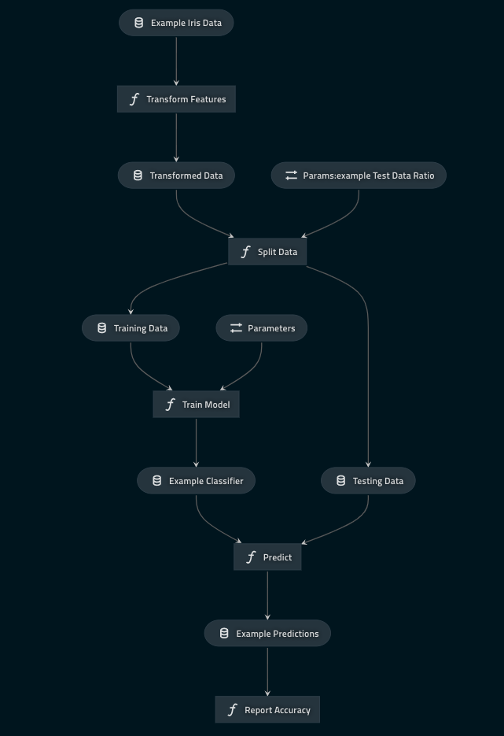

# Kedro Starter: PySpark with example

## Introduction

This repository contains a Kedro project template with some initial configurations and an example pipeline to demonstrate best practices when using Kedro with PySpark. It originates from our [Working with PySpark](https://kedro.readthedocs.io/en/stable/04_user_guide/09_pyspark.html) guide.

## Features

### Spark's configuration in one place, i.e. `/conf/base/spark.yml`

Spark allows you to specify many different [configurations options](https://spark.apache.org/docs/latest/configuration.html). This starter codifies the use of `/conf/base/spark.yml` as the configuration file for these options.

### `SparkSession` initialisation

This starter contains the initialisation code for `SparkSession` in the `ProjectContext` by reading the configuration from `/conf/base/spark.yml`. You should modify this code if you want to further customise your `SparkSession`, e.g. configuring it to use YARN.

### Usage of `MemoryDataSet` when working with Spark objects

Out of the box, `MemoryDataSet` works with Spark's `DataFrame`. However, it doesn't work with other Spark's objects such as machine learning models without further configuration. This starter demonstrates how you can configure `MemoryDataSet` for a Spark's machine learning model in the `catalog.yml`.

Note that the use of `MemoryDataSet` is encouraged to propagate Spark's `DataFrame` between nodes in the pipeline. A best practice is delay triggering Spark actions for as long as needed to take advantage of the Spark's lazy evaluation.

### An example maching learning pipeline using only `PySpark` and `Kedro`

This starter contains the code for an example machine learning pipeline that trains a random forrest classifier to classify iris based on the popular iris dataset. The pipeline includes two modular pipelines: a data engineering one and a data science one.

The data engineering pipeline includes:
* A node to transform multiple features into a single-column features vector using `VectorAssembler`, as well as convert a textual represntation of the label column into a numerical one using `StringIndexer`
* A node to split the transformed data into training dataset and testing dataset using a configurable ration

The data science pipeline includes:
* A node to train the random forrest classifier using `pyspark.ml.classification.RandomForestClassifier`
* A node to make predictions using this classifier on the testing dataset
* A node to evaluate the model based on its predictions using `pyspark.ml.evaluation.MulticlassClassificationEvaluator`
